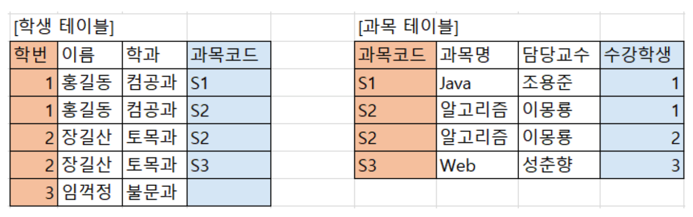

# ETC

Library vs Framework

 
<h3>✅ Library</h3>

- 내 코드가 주체가 되고 필요하다면 외부에서 끌어와 기능을 사용합니다.

<h3>✅ Framework</h3>

- 동작할 수 있는 환경이 구성되어 있고 내 코드가 프레임 안에 들어가 동작합니다.

M : N 관계를 지양해야하는 이유

 
<h3>❓ 다대다 관계를 DB에 표현할 때 왜 지양해야 할까요?</h3>

✅ 다대다로 테이블을 구성한다면 다음과 같은 모습을 볼 수 있습니다.

 
<h3>🤔 다대다를 사용한다면 어떤 문제가 발생하나요?</h3>

- 테이블의 PK가 없어집니다. 학생 테이블에서는 학번만으로 데이터를 구분할 수 없어지고 과목 테이블 또한 마찬가지입니다.

- 검색을 수행한다고 했을 때 어느 테이블에서 확인해야하는지 책임소재가 명확하지 않습니다.

- 만약 학생 테이블이 변경했다면 변경되는 레코드의 수가 많아져 리소스가 많이 발생합니다.

❗️ JPA ORM 도구는 Entity와 DB Table을 연결을 사용자에게 제공합니다. 따라서 다대다 관계가 도메인에 존재한다면 Entity도 Table과 매핑해 사용해야합니다.

<h3>🤔 JPA ManyToMany 사용을 지양해야하는 이유는 뭔가요?</h3>

- **중간 테이블을 생성**해주긴 하지만 묵시적으로 생서애주기 때문에 프로그래머가 모르는 복잡한 Join Query가 발생하는 경우가 생길 수 있습니다.

- 중간 테이블이 생성된다면 해당 테이블에선 두 테이블의 기본키 이외에 필요한 추가 컬럼을 사용할 수 없습니다.

Test Redis 환경 구축

 
<h2>🤔 Redis Container vs Embedded Redis</h2>

📚 Redis Container vs Embedded Redis 두 환경은 같은 Redis를 사용하지만 다르게 동작합니다. 각각의 장단점을 알아봅시다.

<h3>🍎 Redis Container의 장단점</h3>>

- Container Redis는 독립된 Redis 서버를 Container 형태로 실행합니다. 주로 Docker를 사용합니다.

<h4>✓ 장점</h4>

- 외부 Redis 서버와 동일한 기능과 구성 옵션을 제공합니다. 테슽 환경에서 실제 운영 환경과 동일한 Redis 서버를 사용할 수 있습니다.

- 복잡한 환경이나 다른 시스템과의 통합 테스트를 보다 유연하게 처리할 수 있습니다.

<h4>✓ 단점</h4>

- Redis Container를 실행하고 관리해야 하므로, Test 환경을 구성하는데 추가적인 작업이 필요합니다. Container를 띄우는데 시간이 Embedded Redis 실행 환경 보다 오래 소요됩니다.

- 테스트 실행 시간이 조금 느릴 수 있습니다. Redis 서버에 네트워크 호출이 필요하기 때문에 약간의 성능 오버헤드가 발생할 수 있습니다.

<h3>🍎 Embedded Redis의 장단점</h3>>

- Embedded Redis는 애플리케이션에 내장되어 있는 Redis 서버입니다.

<h4>✓ 장점</h4>

- 테스트 환경을 구성하는 데 간편하고 빠릅니다. Redis 서버를 별도로 구성할 필요가 없습니다.

<h4>✓ 단점</h4>

- 애플리케이션과 함께 실행되므로, 애플리케이션의 메모리 사용량이 증가할 수 있습니다.

<h3>🤔 그렇다면 어떤 Redis 서버 환경을 사용하면 될까요?</h3>>

- 프로젝트마다 구성 방식은 다르지만 간단한 테스트 환경을 구성하고 빠른 실행 시간을 원한다면 Embedded Redis를 사용하는 것이 좋고 실제 운영 환경과 가까운 테스트 환경이 필요하거나 복잡한 시나리오를 테스트해야 한다면 Container Redis를 사용하는 것이 더 적합합니다.

